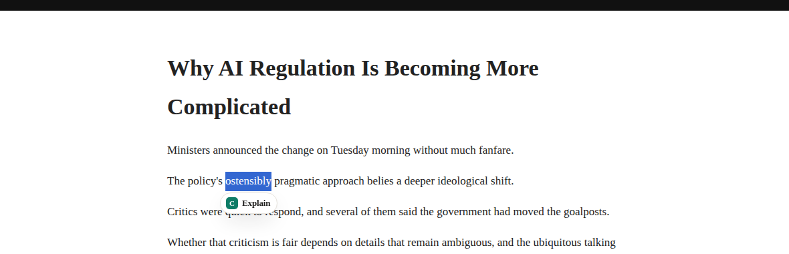

# ClariWord AI

**Understand what you read. Remember what you learn.**

A Chrome extension (Manifest V3) that explains a word, phrase or sentence *in the
context you found it*, shows you how to say it, and keeps it — with the sentence
you met it in — so you can actually remember it later.

<p align="center">
  
</p>

Not a dictionary popup:

| A dictionary answers | ClariWord answers |
| --- | --- |
| What does this word mean? | What does it mean **here**? |
| | Why did the author choose **this** word? |
| | How do I **say** it? |
| | Where did I **meet** it, and how do I keep it? |

---

## Contents

- [What it does](#what-it-does)
- [Install it in five minutes](#install-it-in-five-minutes)
- [Try it without a backend](#try-it-without-a-backend-demo-mode)
- [Connect a real AI backend](#connect-a-real-ai-backend)
- [Architecture](#architecture)
- [Folder structure](#folder-structure)
- [Permissions, and why each one is there](#permissions-and-why-each-one-is-there)
- [Privacy](#privacy)
- [Development](#development)
- [Testing](#testing)
- [Chrome Web Store readiness](#chrome-web-store-readiness)
- [Roadmap](#roadmap)
- [What is left for production](#what-is-left-for-production)

---

## What it does

**Highlight anything.** A small ClariWord button appears next to the selection
(or a five-action toolbar, if you prefer — it is a setting). Click it and a
compact card opens *immediately*, with a loading line, then the explanation.

ClariWord decides for itself what you selected and answers accordingly:

- **A word** → the contextual meaning first, then the general one; IPA, a
  reader-friendly respelling with the stressed syllable marked, part of speech,
  tone and register, synonyms, an everyday alternative, an example, and what the
  choice of *that* word suggests.
- **A phrase or idiom** → explained as a unit, literal image included where it
  helps, with the register (idiomatic, business, academic…) spelled out.
- **A sentence** → a plain-English meaning, a clause-by-clause breakdown, what
  the author is really getting at, a simpler rewrite, and the vocabulary worth
  learning. Not a pile of definitions.
- **A longer passage** → a summary, key points, and a sentence-by-sentence pass.

**Ask follow-ups.** "Why did the author use this?" "Is this formal English?"
"Give me another example." The conversation stays scoped to what you highlighted.

**Hear it.** Text-to-speech for the word, the phrase, the sentence or the
simplified rewrite, in American or British English, at a speed you choose.

**Practise it.** A dedicated page plays the model pronunciation, records yours,
and — when a speech backend is configured — scores it. Without one, it says so
plainly rather than inventing a number.

**Keep it.** Saving a word stores the definition, the contextual meaning, the
pronunciation, **and the exact sentence, page and date where you met it**. Meet
it again later and ClariWord counts the encounter instead of duplicating it.

**Review it.** A quick multiple-choice review, scheduled by an SM-2 style
algorithm, that always shows you the original sentence after you answer —
because that is what makes a word stick.

---

## Install it in five minutes

```bash
git clone <this repo>
cd clariword-ai
npm install
npm run build
```

Then in Chrome:

1. Open `chrome://extensions`
2. Turn on **Developer mode** (top right)
3. Click **Load unpacked**
4. Select the **`dist/`** folder (not the project root)

Pin the ClariWord icon to your toolbar, open any article, and highlight a word.

> A prebuilt `release/clariword-ai-1.0.0.zip` is also produced by
> `npm run package` if you would rather unzip than build.

---

## Try it without a backend (demo mode)

ClariWord ships in **demo mode** and works immediately with no server and no API
key. Demo mode uses a small hand-written lexicon — real lexicography, not model
output — for these entries:

`ostensibly` · `pragmatic` · `belies` · `ideological` · `ambiguous` ·
`meticulous` · `ubiquitous` · `counterintuitive` · `nuance` · `salient` ·
`ephemeral` · `scrutiny` · `mitigate` · `arbitrary`

plus the phrases `move the goalposts`, `the elephant in the room`,
`double-edged sword`, and a fully worked sentence breakdown for:

> *The policy's ostensibly pragmatic approach belies a deeper ideological shift.*

**Anything outside that list returns a clearly-labelled placeholder.** Demo mode
never passes invented definitions off as knowledge — if ClariWord does not know,
it says "Demo mode — ClariWord has no offline entry for …".

A ready-made test page lives at `tests/fixtures/article.html`. Serve it over
http (content scripts do not run on `file://`):

```bash
npx http-server tests/fixtures -p 5555   # or any static server
```

---

## Connect a real AI backend

**The extension never holds an AI provider key.** That is the single most
important architectural decision in this project:

```
Extension  ──chrome.runtime──▶  Service worker  ──HTTPS──▶  Your backend  ──▶  AI provider
(no secrets)                    (the only network caller)    (holds the key)
```

A reference backend is included — dependency-free Node, ~250 lines:

```bash
cd backend
cp .env.example .env        # add PROVIDER + your API key
node --env-file=.env server.js
```

It exposes `POST /api/explain`, `POST /api/chat`, `GET /api/health` and a
deliberately-unimplemented `POST /api/pronunciation`. It ships adapters for
Anthropic and any OpenAI-compatible endpoint, plus an `echo` provider that runs
with no key at all so you can test the wiring. Full request/response contract:
[`docs/API.md`](docs/API.md).

Then in ClariWord → **Settings → AI backend**: set Mode to **Backend**, paste
the URL, and press **Test connection** (this is also where Chrome asks for
permission to contact that host — ClariWord requests it per-host, on demand,
rather than asking for the whole web up front).

```bash
cd backend && node smoke.js    # 11 checks, no API key needed
```

---

## Architecture

Three contexts, with a clear rule about what each may do.

```
┌──────────────────────────────── web page ────────────────────────────────┐
│  content script  (src/content/)                                          │
│    selection-manager   passive listeners, 140 ms settle, no observers    │
│    context-extractor   the sentence + one neighbour each side, capped    │
│    positioning         viewport- and sticky-header-aware placement       │
│    ui/                 all rendering, inside a CLOSED Shadow DOM          │
│                                                                          │
│  never touches the network · holds no secrets · never writes storage     │
└────────────────────────────────┬─────────────────────────────────────────┘
                  chrome.runtime │ typed message bus (shared/messaging.ts)
┌────────────────────────────────▼─────────────────────────────────────────┐
│  service worker  (src/background/)                                       │
│    ai-service          the ONLY network caller; cache + rate limit       │
│    vocabulary-service  the ONLY writer, so updates are serialised        │
│    stats / settings / migrations / context menus / commands              │
└────────────────────────────────┬─────────────────────────────────────────┘
                                 │ HTTPS
                        ┌────────▼─────────┐
                        │   your backend   │  ← the API key lives here
                        └──────────────────┘

  extension pages (src/popup, options, vocabulary, review, practice)
    talk to the service worker over the same typed bus
```

Design decisions worth calling out:

- **Closed Shadow DOM + `all: initial`.** Page CSS cannot reach our UI and our
  CSS cannot leak out. The test fixture deliberately ships hostile CSS
  (`* { box-sizing: content-box !important }`, `button { border: 6px dotted lime !important }`)
  and the e2e suite asserts the card is unaffected. Development builds use an
  *open* root so tests can drive it; production is closed.
- **No innerHTML anywhere in the injected UI.** Everything is built with a small
  `el()` helper that only ever sets `textContent`, so page text and model output
  can never become markup.
- **The zero-size root.** The shadow host is 0×0; every floating piece is
  `position: fixed` on its own. An idle page carries no full-screen layer.
- **Storage behind an interface.** `KeyValueStore` has four methods;
  `ChromeStore` and `MemoryStore` implement it today, a cloud adapter can
  implement it tomorrow without touching a single call site. A forward-only
  migration runner (`services/migrations.ts`) is already wired to
  `chrome.runtime.onInstalled`.
- **Validation on both sides of the wire.** The backend refuses malformed model
  output *and* the extension re-validates before rendering. Required fields fail
  loudly; decorative ones are coerced, so one missing synonym never blanks a card.
- **Demo mode runs the real code path** — mock output goes through the same
  validator and the same renderer as a live backend response.

More detail: [`docs/ARCHITECTURE.md`](docs/ARCHITECTURE.md).

---

## Folder structure

```
clariword-ai/
├── src/
│   ├── manifest.json              MV3 manifest
│   ├── types/index.ts             every shared type; no Chrome APIs, so tests can import it
│   ├── shared/
│   │   ├── constants.ts  defaults.ts  errors.ts
│   │   ├── messaging.ts           typed request/response bus + handler registration
│   │   ├── schema.ts              validation of anything a model produced
│   │   └── text.ts                sentence splitting, normalisation, phonetics, ids
│   ├── services/
│   │   ├── ai-service.ts          backend client, privacy trimming, cache, rate limit
│   │   ├── mock-ai.ts             demo mode
│   │   ├── mock-lexicon.ts        the hand-written demo entries
│   │   ├── storage-service.ts     KeyValueStore + Chrome/Memory adapters + write queue
│   │   ├── settings-service.ts    cached settings with change broadcast
│   │   ├── vocabulary-service.ts  entries, encounters, SM-2 scheduling, review questions
│   │   ├── stats-service.ts       local daily counts and streaks
│   │   ├── speech-service.ts      text-to-speech
│   │   ├── pronunciation-service.ts  scoring interface + backend/simulated scorers
│   │   └── migrations.ts          forward-only storage migrations
│   ├── background/
│   │   ├── service-worker.ts      message routing, lifecycle, badge
│   │   └── context-menus.ts       right-click integration
│   ├── content/
│   │   ├── index.ts               the controller
│   │   ├── selection-manager.ts   context-extractor.ts   positioning.ts
│   │   └── ui/                    shadow-host · floating-trigger · quick-toolbar
│   │                              explanation-card · card-renderers · dom · icons · styles
│   ├── popup/  options/  vocabulary/  review/  practice/      extension pages
│   ├── ui/                        theme.css + page helpers shared by those pages
│   └── assets/icons/              16 / 32 / 48 / 128 / 512
├── backend/                       reference server (no dependencies)
├── tests/                         unit tests + the hostile-CSS article fixture
├── scripts/                       icons · e2e · screenshots · zip
├── docs/                          ARCHITECTURE · API · TESTING · PRIVACY
├── build.mjs                      esbuild pipeline
└── dist/                          ← load this folder in Chrome
```

---

## Permissions, and why each one is there

| Permission | Why |
| --- | --- |
| `storage` | Saved vocabulary and daily counts (`local`), settings (`sync`, so they follow you). |
| `contextMenus` | The "Explain with ClariWord AI" right-click menu. |
| `activeTab` | Act on the tab you are actually looking at, for the keyboard shortcut. |
| `scripting` | Reserved for on-demand injection; the content script is declared, not injected. |
| `content_scripts` on `http/https` | The product is "highlight anything while reading". The Chrome Web Store is excluded. |
| `optional_host_permissions` | **Not granted at install.** Requested per-host, from Settings, only when you point ClariWord at your backend. |

Deliberately **not** requested: `tabs` (we message tabs without reading their
URLs), `<all_urls>` host access, `history`, `downloads`, `unlimitedStorage`,
`background`. The microphone is requested by the practice page — an extension
page with its own origin — so the prompt names ClariWord and the grant never
touches the sites you read.

---

## Privacy

What leaves your browser on a lookup, with default settings:

- the text you highlighted
- the sentence it sits in
- the sentence before and after (toggleable)

That is all. **The page URL is never transmitted** — not even with page metadata
enabled, because query strings carry identifiers; only the bare domain is, and
only if you opt in. Settings shows you the exact list, generated from the same
function that builds the request, so it cannot drift from reality.

Everything else stays on your machine: saved vocabulary, encounter history,
daily counts, review schedule. There is no analytics, no telemetry, no account.
Settings → **Export JSON** hands you everything; **Clear saved data** removes it.

Full detail: [`docs/PRIVACY.md`](docs/PRIVACY.md).

---

## Development

```bash
npm install
npm run dev        # esbuild watch → dist/ (reload the extension after a rebuild)
npm run build      # production build
npm run typecheck  # tsc --noEmit, strict
npm test           # 55 unit tests
npm run package    # release/clariword-ai-<version>.zip
npm run verify     # typecheck + unit tests + production build
```

TypeScript throughout, bundled with esbuild. No runtime dependencies — nothing
ships in `dist/` that you did not write. `@/` maps to `src/`.

Development builds set `__DEV__`, which turns on verbose errors and an **open**
shadow root (so the e2e suite can drive the injected UI). Production builds close
it.

---

## Testing

### Automated

```bash
npm test                   # 55 unit tests   (node --test, no browser)
node scripts/e2e.mjs       # 36 checks in a real Chromium with the extension loaded
cd backend && node smoke.js  # 11 backend checks, no API key needed
```

The e2e suite loads the unpacked extension into Chromium and drives the real
thing: selection → trigger placement → card → contextual ordering → CSS
isolation against hostile page styles → follow-up chat → save → Escape → click
outside → sentence breakdown → phrase handling → the dashboard, popup, review,
settings and practice pages → **and a live round-trip through the reference
backend over HTTP**.

```
node scripts/e2e.mjs
  ✔ service worker starts
  ✔ content script injects its host element
  ✔ floating trigger appears next to the selection
  ✔ trigger stays inside the viewport
  ✔ card opens immediately
  ✔ loading state is shown while the AI works
  ✔ card headline is the selected word
  ✔ IPA is rendered
  ✔ stressed syllable is marked
  ✔ contextual meaning comes first
  ✔ demo-mode notice is shown
  ✔ "why this word" reasoning is present
  ✔ page CSS cannot reach the card (box-sizing)
  ✔ page CSS cannot reach the card (font-size)
  ✔ page CSS cannot restyle our buttons
  ✔ follow-up chat answers
  ✔ save button confirms
  ✔ Escape closes the card
  ✔ sentence view breaks the sentence down
  ✔ sentence view lists key vocabulary
  ✔ sentence view offers a simpler rewrite
  ✔ sentence segments are explained, not defined word by word
  ✔ clicking outside closes the card
  ✔ phrases are treated as a unit
  ✔ saved word appears in the dashboard
  ✔ detail view keeps the original sentence
  ✔ detail view names the source page
  ✔ popup shows the saved count
  ✔ review page builds a question
  ✔ settings explains exactly what is transmitted
  ✔ page URL is never listed as transmitted
  ✔ practice page loads the word
  ✔ practice is honest about scoring availability
  ✔ a real HTTP backend round-trips into the card
  ✔ backend responses are not labelled as demo data
  ✔ no uncaught page errors

36/36 checks passed
```

### Manual

A checklist covering real sites, dark mode, keyboard-only use and the failure
paths is in [`docs/TESTING.md`](docs/TESTING.md).

---

## Chrome Web Store readiness

Ready now:

- Manifest V3, no remote code, strict extension CSP, no `eval`
- Minimal permissions; host access requested on demand
- Icons at 16 / 32 / 48 / 128 (plus a 512 master for the listing)
- `npm run package` produces an uploadable zip

**Listing copy**

> **Name** ClariWord AI
> **Short description** Your AI reading and vocabulary companion.
> **Description** Understand difficult words and sentences in context, improve
> your pronunciation, and remember vocabulary from anything you read online.

Still to produce before submission: 1280×800 screenshots and a 440×280 tile, a
hosted privacy policy URL (use `docs/PRIVACY.md` as the copy), and the
single-purpose justification — "explain and remember vocabulary encountered while
reading web pages" — plus a line per permission, which the table above gives you.

---

## Roadmap

**Phase 1 — shipped here.** MV3 setup, selection detection, floating trigger and
quick toolbar, explanation card, context extraction, demo mode, the backend
interface, word / phrase / sentence / passage explanations, text-to-speech,
right-click menu, save, local storage, popup, settings, vocabulary dashboard.

**Phase 2 — shipped here too.** Follow-up chat, vocabulary review, repeated-
encounter tracking, grammar explanations, pronunciation practice with recording.

**Phase 3 — designed for, not built.** The data model, scheduler and storage
interface are in place for: adaptive difficulty from the signals already being
recorded (lookups, saves, encounters, review outcomes), full spaced repetition
(`ReviewState` already carries interval, ease, repetitions and lapses), cloud
sync and cross-device vocabulary (implement `KeyValueStore` against your API),
and real pronunciation scoring (implement `PronunciationScorer`, or wire
`POST /api/pronunciation`).

---

## What is left for production

Honest list, in the order I would do it:

1. **A hosted backend.** The reference server is correct and bounded but
   single-process and in-memory. Put it behind your infrastructure, add a
   persistent rate-limit store, set `ALLOWED_ORIGINS` to your published
   extension id, and set `ACCESS_TOKEN`.
2. **Prompt tuning against real pages.** `backend/prompts.js` encodes the
   product rules; the wording of the level guidance is where quality lives, and
   it wants iteration against Wikipedia, Medium, arXiv and documentation.
3. **Pronunciation scoring.** The interface, the recorder and the UI are done;
   the speech model is not. `POST /api/pronunciation` returns 501 on purpose.
4. **Cost controls.** Per-user quotas and caching at the backend; the extension
   already caches and rate-limits locally, which is not a substitute.
5. **iframe support.** Content scripts run in the top frame only today, so a
   selection inside an embedded reader is not picked up.
6. **More of the lexicon in demo mode**, if demo mode is meant to be a real
   offline fallback rather than a development aid.
7. **Localisation.** All copy is inline English; extracting it to `_locales`
   is mechanical but not done.
